# Handleiding

## VM

Voor de lokale testomgeving werd een Rocky Linux VM gebruikt. Deze VM diende als centrale omgeving waarop Docker, k3s, Keycloak, AWX en Vault werden geïnstalleerd.

### VM-specificaties

| Onderdeel         | Waarde          |
| ----------------- | --------------- |
| Besturingssysteem | Rocky Linux 9.7 |
| RAM               | 6 GB            |
| CPU               | 4 cores         |
| Disk              | 50 GB           |
| IP-adres          | 192.168.140.141 |

## Voorbereiding van de VM

Eerst werden enkele services uitgeschakeld die netwerkproblemen konden veroorzaken tijdens de installatie.

```bash
sudo systemctl disable firewalld --now
sudo systemctl disable nm-cloud-setup.service nm-cloud-setup.timer
sudo reboot
```

Na de reboot werden de nodige basispakketten geïnstalleerd.

```bash
sudo dnf install -y git curl
```

## k3s installatie

Voor de lokale Kubernetes-omgeving werd **k3s** gebruikt. k3s is een lightweight Kubernetes-distributie die geschikt is voor kleinere VM’s en lokale testomgevingen.

Binnen deze omgeving werd AWX uitgevoerd.

### k3s installeren

k3s werd geïnstalleerd met volgende command:

```bash
curl -sfL https://get.k3s.io | INSTALL_K3S_VERSION=v1.29.6+k3s2 sh -s - --write-kubeconfig-mode 644
```

De optie `--write-kubeconfig-mode 644` zorgt ervoor dat de kubeconfig leesbaar is voor `kubectl`, zonder telkens extra permissies te moeten aanpassen.

### k3s controleren

Controleer of k3s correct geïnstalleerd is:

```bash
k3s --version
```

Controleer daarna of de Kubernetes-node actief is:

```bash
kubectl get nodes
```

Voor meer details:

```bash
kubectl get nodes -o wide
```

Voorbeeldoutput:

```text
NAME                    STATUS   ROLES                  AGE    VERSION        INTERNAL-IP       EXTERNAL-IP   OS-IMAGE                      KERNEL-VERSION                CONTAINER-RUNTIME
localhost.localdomain   Ready    control-plane,master   116d   v1.29.6+k3s2   192.168.140.141   <none>        Rocky Linux 9.7 (Blue Onyx)   5.14.0-611.5.1.el9_7.x86_64   containerd://1.7.17-k3s1
```

Hieruit blijkt dat de Kubernetes-node actief is en draait op **k3s versie v1.29.6+k3s2**.

### k3s-service controleren

Omdat k3s als systemd-service draait, kan de status gecontroleerd worden met:

```bash
systemctl status k3s --no-pager
```

Wanneer k3s correct draait, staat de service op:

```text
Active: active (running)
```

Ook kan gecontroleerd worden waar de k3s binary staat:

```bash
which k3s
```

Voorbeeldoutput:

```text
/usr/local/bin/k3s
```

### Kubernetes-resources controleren

De status van Kubernetes-resources kan gecontroleerd worden met:

```bash
kubectl get pods
kubectl get svc
kubectl get pods -A
```

| Commando                    | Beschrijving                                                     |
| --------------------------- | ---------------------------------------------------------------- |
| `kubectl get nodes`         | Toont de Kubernetes-nodes.                                       |
| `kubectl get nodes -o wide` | Toont extra details zoals versie, IP-adres en container runtime. |
| `kubectl get pods`          | Toont de actieve pods binnen de huidige namespace.               |
| `kubectl get pods -A`       | Toont alle pods in alle namespaces.                              |
| `kubectl get svc`           | Toont de services en bijhorende IP-adressen/poorten.             |
| `systemctl status k3s`      | Controleert of de k3s-service actief draait.                     |

## Keycloak

Keycloak wordt gebruikt als Access Management-systeem binnen deze opstelling. AWX voert via Ansible-playbooks configuraties uit op Keycloak, zoals het aanmaken van realms, users en SAML-clients.

In de uiteindelijke opstelling werd Keycloak via Docker Compose gestart. Er werd ook getest met een Kubernetes-installatie, maar die aanpak werd niet gebruikt als definitieve oplossing.

## Keycloak via Docker Compose

### Waarom Docker Compose?

Keycloak werd uiteindelijk via Docker Compose geïnstalleerd omdat deze methode eenvoudiger en stabieler werkte voor de lokale testomgeving. De container kan automatisch opnieuw opstarten na een reboot en de data blijft behouden via een Docker-volume.

### `docker-compose.yml`

```yaml
services:
  keycloak:
    image: quay.io/keycloak/keycloak:26.5.3
    container_name: keycloak
    restart: unless-stopped
    ports:
      - "8080:8080"
    environment:
      KC_BOOTSTRAP_ADMIN_USERNAME: admin
      KC_BOOTSTRAP_ADMIN_PASSWORD: admin
    command: start-dev
    volumes:
      - keycloak_data:/opt/keycloak/data

volumes:
  keycloak_data:
```

### Keycloak starten

```bash
docker compose up -d
```

### Keycloak controleren

Controleer of de container actief is:

```bash
docker ps
```

Bekijk de logs:

```bash
docker compose logs
```

### Uitleg configuratie

| Configuratie                  | Beschrijving                                                                                     |
| ----------------------------- | ------------------------------------------------------------------------------------------------ |
| `image`                       | Gebruikte Keycloak-containerimage.                                                               |
| `container_name`              | Naam van de container.                                                                           |
| `restart: unless-stopped`     | Zorgt ervoor dat Keycloak opnieuw start na een reboot, tenzij de container manueel gestopt werd. |
| `ports: "8080:8080"`          | Maakt Keycloak bereikbaar via poort 8080 op de VM.                                               |
| `KC_BOOTSTRAP_ADMIN_USERNAME` | Admin-gebruikersnaam voor de eerste login.                                                       |
| `KC_BOOTSTRAP_ADMIN_PASSWORD` | Admin-wachtwoord voor de eerste login.                                                           |
| `command: start-dev`          | Start Keycloak in development mode.                                                              |
| `keycloak_data`               | Docker-volume waarin Keycloak-data persistent wordt bewaard.                                     |

Het volume `keycloak_data` zorgt ervoor dat configuratie, realms, users en clients behouden blijven wanneer de container opnieuw wordt gestart.

Keycloak is bereikbaar via:

```text
http://192.168.140.141:8080/
```

## Keycloak via Kubernetes/k3s test

### Doel van deze test

Naast de Docker Compose-installatie werd ook getest of Keycloak rechtstreeks binnen Kubernetes/k3s kon draaien. Hiervoor werd de officiële Keycloak Kubernetes quickstart als basis gebruikt:

```text
https://www.keycloak.org/getting-started/getting-started-kube
```

Deze aanpak werd onderzocht, maar uiteindelijk niet gebruikt als definitieve oplossing omdat Docker Compose stabieler en eenvoudiger werkte binnen deze lokale omgeving.

### Probleem tijdens installatie

Tijdens het ophalen en toepassen van de Kubernetes-configuratie trad er een probleem op. Het oorspronkelijke commando uit de quickstart haalde de configuratie rechtstreeks op via `wget` en paste deze meteen toe met `kubectl`.

```bash
wget -q -O - https://raw.githubusercontent.com/keycloak/keycloak-quickstarts/refs/heads/main/kubernetes/keycloak-ingress.yaml | \
sed "s/KEYCLOAK_HOST/keycloak.$(minikube ip).nip.io/" | \
kubectl create -f -
```

Dit commando was gebaseerd op een voorbeeldomgeving en was niet rechtstreeks bruikbaar binnen de uiteindelijke k3s-opstelling. Daarnaast lukte het ophalen of toepassen van het YAML-bestand niet correct.

Daarom werd de configuratie manueel aangemaakt en aangepast.

### Workaround

De configuratie werd manueel in een YAML-bestand geplaatst.

Stappen:

1. Open de YAML via de browser:

```text
https://raw.githubusercontent.com/keycloak/keycloak-quickstarts/refs/heads/main/kubernetes/keycloak-ingress.yaml
```

2. Kopieer de inhoud naar een lokaal bestand:

```bash
nano keycloak-ingress.yaml
```

3. Pas de inhoud aan zodat de service correct bereikbaar wordt binnen de lokale k3s-omgeving.

4. Pas het bestand toe:

```bash
kubectl create -f keycloak-ingress.yaml
```

### Gebruikte Kubernetes-configuratie

```yaml
apiVersion: v1
kind: Service
metadata:
  name: keycloak
  labels:
    app: keycloak
spec:
  ports:
  - name: http
    port: 8080
    targetPort: 8080
  selector:
    app: keycloak
  type: LoadBalancer
---
apiVersion: apps/v1
kind: Deployment
metadata:
  name: keycloak
  labels:
    app: keycloak
spec:
  replicas: 1
  selector:
    matchLabels:
      app: keycloak
  template:
    metadata:
      labels:
        app: keycloak
    spec:
      containers:
      - name: keycloak
        image: quay.io/keycloak/keycloak:20.0.3
        args: ["start-dev"]
        env:
        - name: KEYCLOAK_ADMIN
          value: "admin"
        - name: KEYCLOAK_ADMIN_PASSWORD
          value: "admin"
        - name: KC_PROXY
          value: "edge"
        ports:
        - name: http
          containerPort: 8080
        readinessProbe:
          httpGet:
            path: /realms/master
            port: 8080
```

### Controle

Na het toepassen van de configuratie werd gecontroleerd of de service actief was:

```bash
kubectl get svc
```

Voorbeeldoutput:

```text
[root@localhost ~]# kubectl get svc
NAME                 TYPE           CLUSTER-IP      EXTERNAL-IP       PORT(S)          AGE
keycloak             LoadBalancer   10.43.21.3      192.168.140.141   8080:31258/TCP   17h
keycloak-discovery   ClusterIP      None            <none>            <none>           17h
kubernetes           ClusterIP      10.43.0.1       <none>            443/TCP          28h
postgres             ClusterIP      10.43.166.118   <none>            5432/TCP         17h
```

Hieruit bleek dat de Keycloak-service bereikbaar was via het externe IP-adres `192.168.140.141` op poort `8080`.

Daarna was Keycloak bereikbaar via:

```text
http://192.168.140.141:8080/
```

### Conclusie

Hoewel Keycloak via Kubernetes/k3s bereikbaar gemaakt kon worden, werd deze aanpak niet gebruikt als definitieve oplossing. Binnen deze lokale testomgeving bleek Docker Compose eenvoudiger, stabieler en beter beheersbaar.

Daarom werd Keycloak uiteindelijk via Docker Compose uitgevoerd.

## AWX installatie

AWX werd geïnstalleerd op de bestaande k3s-cluster. De k3s-installatie werd eerder in deze handleiding uitgevoerd. In dit onderdeel wordt daarom enkel gecontroleerd of k3s actief is voordat AWX geïnstalleerd wordt.

### 1. k3s controleren

Controleer of k3s correct draait:

```bash
k3s --version
kubectl get nodes
kubectl get pods -A
```

Wanneer de node de status `Ready` heeft, kan de AWX-installatie gestart worden.

### 2. AWX-on-k3s repository ophalen

De AWX-installatiebestanden werden opgehaald uit de `awx-on-k3s` repository.

```bash
cd ~
git clone https://github.com/kurokobo/awx-on-k3s.git
cd awx-on-k3s
git checkout 2.19.1
```

### 3. AWX Operator installeren

De AWX Operator werd geïnstalleerd via Kustomize.

```bash
kubectl apply -k operator
```

Controleer daarna of de operator actief is:

```bash
kubectl -n awx get all
```

Verwachte gelijkaardige output:

```text
NAME                                                   READY   STATUS    RESTARTS   AGE
pod/awx-operator-controller-manager-68d787cfbd-kjfg7   2/2     Running   0          16s

NAME                                                      TYPE        CLUSTER-IP      EXTERNAL-IP   PORT(S)    AGE
service/awx-operator-controller-manager-metrics-service   ClusterIP   10.43.150.245   <none>        8443/TCP   16s

NAME                                              READY   UP-TO-DATE   AVAILABLE   AGE
deployment.apps/awx-operator-controller-manager   1/1     1            1           16s

NAME                                                         DESIRED   CURRENT   READY   AGE
replicaset.apps/awx-operator-controller-manager-68d787cfbd   1         1         1       16s
```

### 4. TLS-certificaat aanmaken

Voor de lokale AWX-hostname werd een self-signed TLS-certificaat aangemaakt.

```bash
AWX_HOST="awx.example.com"

openssl req -x509 -nodes -days 3650 -newkey rsa:2048 \
  -out ./base/tls.crt \
  -keyout ./base/tls.key \
  -subj "/CN=${AWX_HOST}/O=${AWX_HOST}" \
  -addext "subjectAltName = DNS:${AWX_HOST}"
```

Dit certificaat werd gebruikt door de AWX ingress.

### 5. AWX-configuratie aanpassen

De belangrijkste AWX-configuratie stond in:

```text
base/awx.yaml
```

Dit bestand werd aangepast met:

```bash
nano base/awx.yaml
```

De gebruikte AWX-configuratie:

```yaml
---
apiVersion: awx.ansible.com/v1beta1
kind: AWX
metadata:
  name: awx
spec:
  admin_user: admin
  admin_password_secret: awx-admin-password

  ingress_type: ingress
  ingress_hosts:
    - hostname: awx.example.com
      tls_secret: awx-secret-tls
    - hostname: localhost-0.tail82c8a4.ts.net
      tls_secret: awx-secret-tls

  postgres_configuration_secret: awx-postgres-configuration

  postgres_data_volume_init: true
  postgres_storage_class: awx-postgres-volume
  postgres_storage_requirements:
    requests:
      storage: 8Gi

  projects_persistence: true
  projects_existing_claim: awx-projects-claim

  web_replicas: 1
  task_replicas: 1

  web_resource_requirements: {}
  task_resource_requirements: {}
  ee_resource_requirements: {}
  init_container_resource_requirements: {}
  postgres_resource_requirements: {}
  redis_resource_requirements: {}
  rsyslog_resource_requirements: {}
```

Belangrijkste instellingen:

| Instelling                           | Betekenis                                               |
| ------------------------------------ | ------------------------------------------------------- |
| `admin_user: admin`                  | AWX admin-gebruiker.                                    |
| `admin_password_secret`              | Kubernetes secret met het admin-wachtwoord.             |
| `ingress_type: ingress`              | Maakt AWX bereikbaar via ingress.                       |
| `ingress_hosts`                      | Hostnames waarop AWX bereikbaar is.                     |
| `postgres_storage_requirements: 8Gi` | Opslag voor AWX PostgreSQL.                             |
| `projects_persistence: true`         | Zorgt ervoor dat projectdata persistent bewaard blijft. |
| `web_replicas: 1`                    | Eén AWX web-pod.                                        |
| `task_replicas: 1`                   | Eén AWX task-pod.                                       |

### 6. Kustomization aanpassen

Naast `awx.yaml` werd ook `base/kustomization.yaml` aangepast. Dit bestand wordt gebruikt door Kustomize om secrets, TLS-bestanden en AWX-resources samen toe te passen.

```bash
nano base/kustomization.yaml
```

In dit bestand werden onder andere de wachtwoorden aangepast voor:

```yaml
- name: awx-postgres-configuration
  type: Opaque
  literals:
    - host=awx-postgres-15
    - port=5432
    - database=awx
    - username=awx
    - password=<POSTGRES_PASSWORD>
    - type=managed

- name: awx-admin-password
  type: Opaque
  literals:
    - password=<AWX_ADMIN_PASSWORD>
```

Belangrijk: het PostgreSQL-wachtwoord mag geen single quotes, double quotes of backslashes bevatten, omdat dit problemen kan geven tijdens deployment, backup of restore.


### 7. Persistent storage voorbereiden

Voor AWX werden directories aangemaakt op de VM. Deze worden gebruikt als hostPath storage voor de PostgreSQL database en AWX projectbestanden.

```bash
sudo mkdir -p /data/postgres-15
sudo mkdir -p /data/projects
sudo chown 1000:0 /data/projects
```

| Directory           | Doel                         |
| ------------------- | ---------------------------- |
| `/data/postgres-15` | Opslag voor AWX PostgreSQL.  |
| `/data/projects`    | Opslag voor AWX projectdata. |

### 8. AWX deployen

Na het aanpassen van de configuratie werd AWX gedeployed met:

```bash
kubectl apply -k base
```

De deployment werd opgevolgd via de logs van de AWX Operator:

```bash
kubectl -n awx logs -f deployments/awx-operator-controller-manager
```

### 9. AWX-status controleren

Na de deployment werd gecontroleerd of alle AWX-resources correct aangemaakt waren.

```bash
kubectl -n awx get awx,all,ingress,secrets
```

Extra controles:

```bash
kubectl get pods -n awx
kubectl get svc -n awx
kubectl get ingress -n awx
```

### 10. AWX-bereikbaarheid testen

AWX werd bereikbaar gemaakt via Ingress met de hostname:

```text
awx.example.com
```

Omdat deze setup gebruikmaakt van Ingress, moet AWX via de hostname bereikt worden die in `base/awx.yaml` staat. Rechtstreeks browsen naar het IP-adres werkt niet altijd correct, omdat de Ingress-controller de hostname gebruikt om het verkeer naar de juiste service te routeren.

Op de Windows-client werd daarom de hosts file aangepast.

Open Notepad als Administrator en open:

```text
C:\Windows\System32\drivers\etc\hosts
```

Voeg volgende regel toe:

```text
192.168.140.141 awx.example.com
```

Daarna is AWX beschikbaar via:

```text
https://awx.example.com/
```

De bereikbaarheid kan getest worden met:

```bash
curl http://awx.example.com
curl https://awx.example.com --insecure
```

Tijdens troubleshooting kan ook het IP-adres getest worden om te controleren of de VM bereikbaar is:

```bash
curl http://192.168.140.141
curl http://192.168.140.141:80
curl https://192.168.140.141:443 --insecure
```

Let op: de browser moet uiteindelijk naar `https://awx.example.com/` gaan, niet naar het IP-adres. De hostname moet overeenkomen met de hostname die in `base/awx.yaml` werd opgegeven.

## HashiCorp Vault

HashiCorp Vault wordt gebruikt om gevoelige waarden centraal en veilig op te slaan. In deze opstelling worden onder andere Keycloak-wachtwoorden en bootstrap-user secrets in Vault bewaard. AWX haalt deze secrets later op tijdens het uitvoeren van Ansible-playbooks.

Vault draait in deze omgeving niet binnen Kubernetes, maar als aparte **systemd-service** op de Rocky Linux VM.

### HashiCorp Vault installeren

Installeer eerst de nodige packages en voeg de HashiCorp repository toe:

```bash
sudo yum install -y yum-utils
sudo yum-config-manager --add-repo https://rpm.releases.hashicorp.com/RHEL/hashicorp.repo
sudo yum -y install vault
```

Controleer daarna of Vault correct geïnstalleerd is:

```bash
vault version
```

### Optioneel: snelle dev-test

Tijdens de eerste testfase kan Vault snel gestart worden in dev mode:

```bash
vault server -dev -dev-root-token-id=root -dev-listen-address=0.0.0.0:8200
```

Deze mode is enkel bedoeld voor lokale tests. Hierbij is de root token `root` en wordt data niet persistent bewaard. Voor de uiteindelijke opstelling werd Vault als systemd-service gebruikt.

### Vault als systemd-service

Vault wordt uiteindelijk als systemd-service gestart, zodat deze automatisch kan opstarten na een reboot.

Bepaal eerst welke Vault binary gebruikt wordt:

```bash
VAULT_BINARY=$(which vault)
echo $VAULT_BINARY
```

Maak daarna de systemd-service aan:

```bash
sudo tee /usr/lib/systemd/system/vault.service > /dev/null <<EOF
[Unit]
Description="HashiCorp Vault"
Documentation="https://developer.hashicorp.com/vault/docs"
ConditionFileNotEmpty=/etc/vault.d/vault.hcl

[Service]
User=vault
Group=vault
SecureBits=keep-caps
AmbientCapabilities=CAP_IPC_LOCK
CapabilityBoundingSet=CAP_SYSLOG CAP_IPC_LOCK
NoNewPrivileges=yes
ExecStart=${VAULT_BINARY} server -config=/etc/vault.d/vault.hcl
ExecReload=/bin/kill --signal HUP \$MAINPID
KillMode=process
KillSignal=SIGINT

[Install]
WantedBy=multi-user.target
EOF
```

Zet de juiste rechten op het servicebestand:

```bash
sudo chmod 644 /usr/lib/systemd/system/vault.service
```

Herlaad systemd, start Vault en enable de service:

```bash
sudo systemctl daemon-reload
sudo systemctl enable --now vault.service
```

Controleer of Vault draait:

```bash
systemctl status vault.service --no-pager
```

Wanneer Vault correct draait, staat de service op:

```text
Active: active (running)
```

### Firewall

Als `firewalld` actief is, moet poort `8200` geopend worden:

```bash
sudo firewall-cmd --add-port=8200/tcp --permanent
sudo firewall-cmd --reload
```

Voor een lokale labomgeving kan de firewall ook uitgeschakeld worden:

```bash
sudo systemctl disable --now firewalld
```

### Vault openen

Vault is bereikbaar via:

```text
https://<VM-IP>:8200
```

Voorbeeld:

```text
https://192.168.140.141:8200
```

Omdat Vault met een self-signed certificaat werkt, moet de browserwaarschuwing geaccepteerd worden.

Controle via de terminal:

```bash
ss -lntp | grep 8200
curl -k https://127.0.0.1:8200/v1/sys/health
```

### Belangrijk

Bij de eerste setup moet de output met de unseal keys en de initial root token veilig worden opgeslagen. Deze waarden zijn nodig om Vault te unsealen en om de eerste keer in te loggen.

## Vault secret aanmaken

Na het opzetten van Vault werd een secret aangemaakt waarin gevoelige waarden worden opgeslagen. Deze waarden kunnen later door Ansible/AWX opgehaald worden. Hierdoor moeten wachtwoorden niet hardcoded in playbooks of Git staan.

Eerst werd ingelogd op de Vault webinterface via:

```text
https://<VM-IP>:8200
```

Voorbeeld:

```text
https://192.168.140.141:8200
```

Na het inloggen is het Vault dashboard zichtbaar.

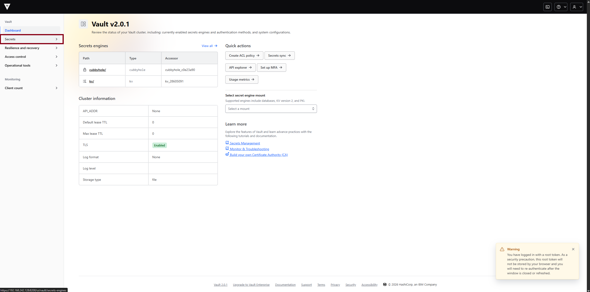

### Secrets engine aanmaken

Om secrets te kunnen opslaan werd een KV secrets engine aangemaakt.

Stappen in de webinterface:

1. Ga naar **Secrets**.
2. Kies **Secrets engines**.
3. Klik op **Enable new engine**.

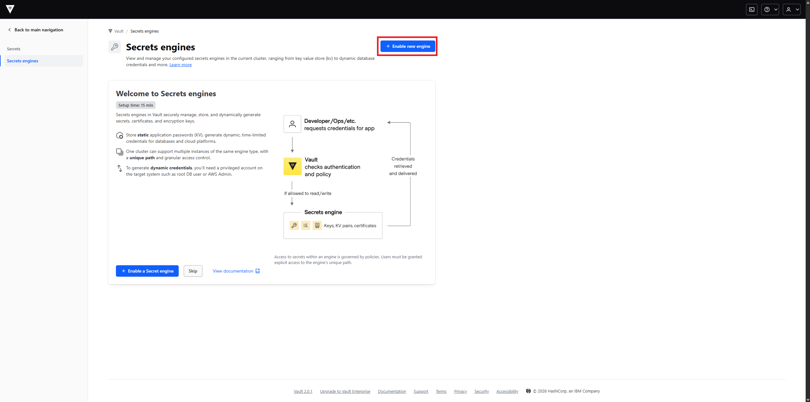

Kies daarna voor het type **KV**. Hiermee kunnen key-value secrets opgeslagen worden.

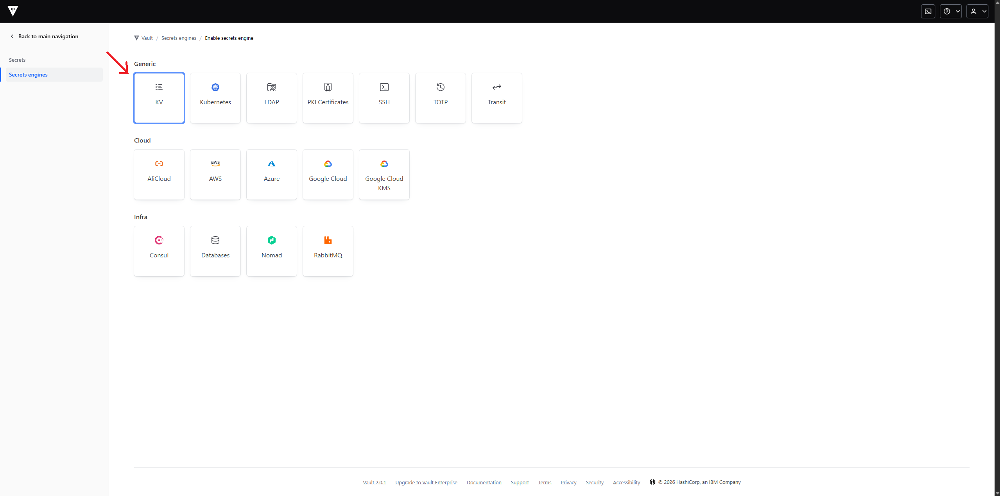

Bij het aanmaken van de KV secrets engine werd **Built-in plugin** geselecteerd. Als path werd in deze handleiding `secret` gebruikt.

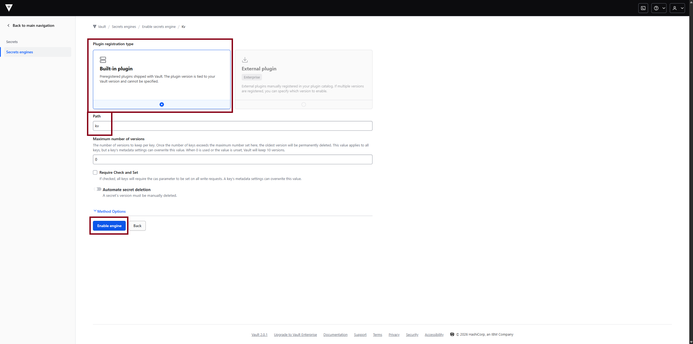

Na het opslaan werd de KV secrets engine succesvol aangemaakt.

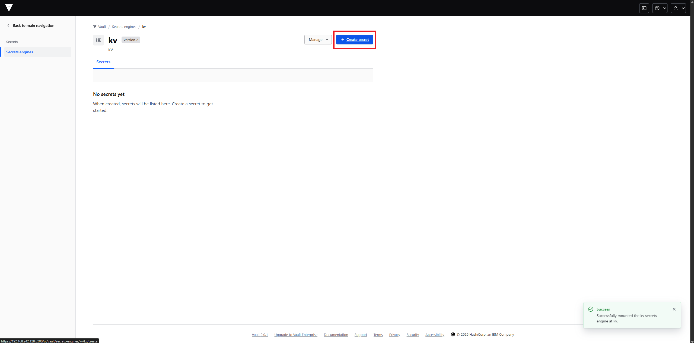

### Secret aanmaken

Binnen de `secret` secrets engine werd daarna een secret aangemaakt.

Stappen:

1. Open de `secret` secrets engine.
2. Klik op **Create secret**.
3. Gebruik als path:

```text
test/keycloak
```

4. Voeg secret data toe, bijvoorbeeld:

```text
password = <KEYCLOAK_PASSWORD>
```

5. Klik op **Save**.

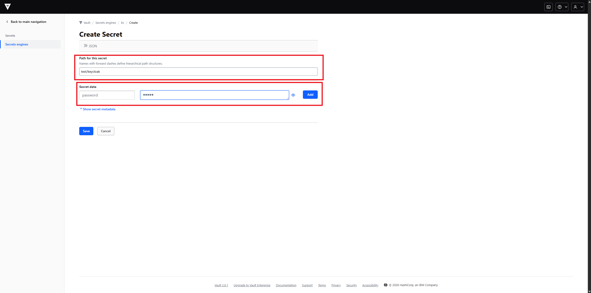

Na het opslaan is het secret beschikbaar onder:

```text
secret/test/keycloak
```

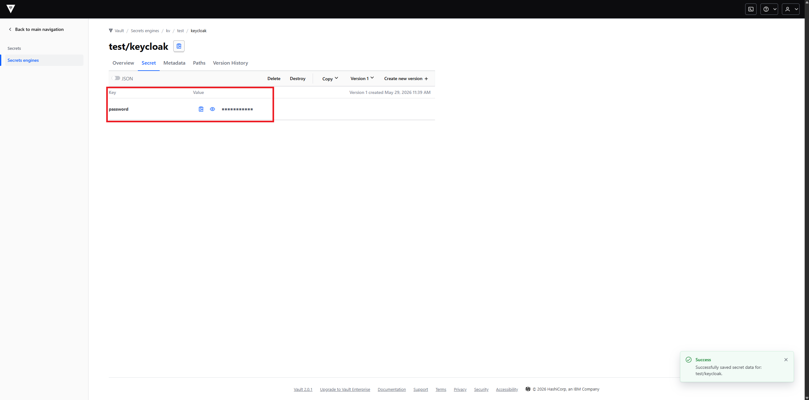

Omdat KV version 2 gebruikt wordt, wordt dit technisch via de API aangesproken als:

```text
secret/data/test/keycloak
```

Dit pad is belangrijk voor Ansible/AWX, omdat de playbooks later dit Vault-pad gebruiken om het wachtwoord correct op te halen. Hierdoor blijft het Keycloak-wachtwoord centraal beheerd in Vault en wordt het niet rechtstreeks in de repository opgeslagen.

## AWX configureren

AWX moet toegang krijgen tot de Git repository waarin de Ansible playbooks staan. Hiervoor werd een SSH key pair aangemaakt.

De **public key** wordt toegevoegd aan GitHub. De **private key** wordt toegevoegd aan AWX als `Source Control` credential.

## Git verbinding met AWX

### SSH key pair aanmaken

Op de VM werd eerst een SSH key pair aangemaakt:

```bash
ssh-keygen -t ed25519 -C "awx-github"
```

Tijdens het aanmaken kan een bestandsnaam gekozen worden, bijvoorbeeld:

```text
/root/.ssh/awx_github
```

Daarna zijn er twee bestanden:

```text
/root/.ssh/awx_github
/root/.ssh/awx_github.pub
```

| Bestand                     | Doel                                          |
| --------------------------- | --------------------------------------------- |
| `/root/.ssh/awx_github`     | Private key, deze wordt toegevoegd aan AWX.   |
| `/root/.ssh/awx_github.pub` | Public key, deze wordt toegevoegd aan GitHub. |

De public key kan bekeken worden met:

```bash
cat /root/.ssh/awx_github.pub
```

### Public key toevoegen aan GitHub

De public key werd toegevoegd aan GitHub zodat AWX de repository kan benaderen via SSH.

Stappen in GitHub:

1. Ga naar **Settings**.
2. Ga naar **SSH and GPG keys**.
3. Klik op **New SSH key**.
4. Geef de key een duidelijke naam, bijvoorbeeld:

```text
awx-github
```

5. Plak de inhoud van:

```bash
cat /root/.ssh/awx_github.pub
```

6. Sla de key op.

De private key mag nooit toegevoegd worden aan GitHub of gedeeld worden.

### Private key toevoegen aan AWX

Daarna werd in AWX een credential aangemaakt voor Git.

Ga in AWX naar:

```text
Resources → Credentials → Add
```

Gebruik volgende instellingen:

| Veld            | Waarde                             |
| --------------- | ---------------------------------- |
| Name            | `github_key`                       |
| Credential Type | `Source Control`                   |
| SCM Private Key | Inhoud van `/root/.ssh/awx_github` |

De private key kan bekeken worden met:

```bash
cat /root/.ssh/awx_github
```

Deze private key werd in AWX geplakt bij **SCM Private Key**.

## Git repository synchroniseren met AWX

Nadat de Source Control credential werd aangemaakt, werd in AWX een project aangemaakt. Dit project koppelt AWX aan de Git repository waarin de Ansible playbooks staan.

Ga in AWX naar:

```text
Resources → Projects → Add
```


Gebruik volgende instellingen:

| Veld                      | Waarde                          |
| ------------------------- | ------------------------------- |
| Name                      | `custom-playbooks`              |
| Organization              | `Default`                       |
| Source Control Type       | `Git`                           |
| Source Control URL        | SSH-link naar de Git repository |
| Source Control Credential | `github_key`                    |

Voorbeeld van een Source Control URL:

```text
git@github.com:<user>/<repository>.git
```

Bij **Options** werden volgende opties aangevinkt:

| Optie                       | Betekenis                                                                            |
| --------------------------- | ------------------------------------------------------------------------------------ |
| `Clean`                     | Verwijdert lokale wijzigingen voordat AWX de repository opnieuw synchroniseert.      |
| `Update Revision on Launch` | Haalt telkens de nieuwste versie van de repository op wanneer een job gestart wordt. |


Na het opslaan werd het project gesynchroniseerd. In het Projects-overzicht kreeg het project de status **Successful**. Dit betekent dat AWX de Git repository correct kon bereiken en de playbooks succesvol kon ophalen.

Hierdoor kan AWX de playbooks uit de repository gebruiken in Job Templates.

## AWX Job Template, Execution Environment en Webhook

Nadat het AWX Project gekoppeld was aan Git, werd een Job Template aangemaakt. Deze template bepaalt welk playbook AWX moet uitvoeren, met welke inventory, welk project en welke Execution Environment.

### Job Template aanmaken

Ga in AWX naar:

```text
Resources → Templates → Add → Add job template
```

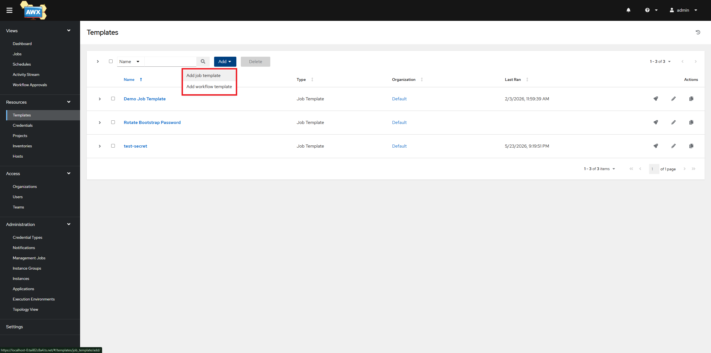

Voor de test werd de template `test-secret` gebruikt.

Belangrijkste instellingen:

| Veld                  | Waarde                   |
| --------------------- | ------------------------ |
| Name                  | `test-secret`            |
| Job Type              | `Run`                    |
| Inventory             | `Demo Inventory`         |
| Project               | `custom-playbooks`       |
| Playbook              | `create_saml_client.yml` |
| Execution Environment | `hvac`                   |

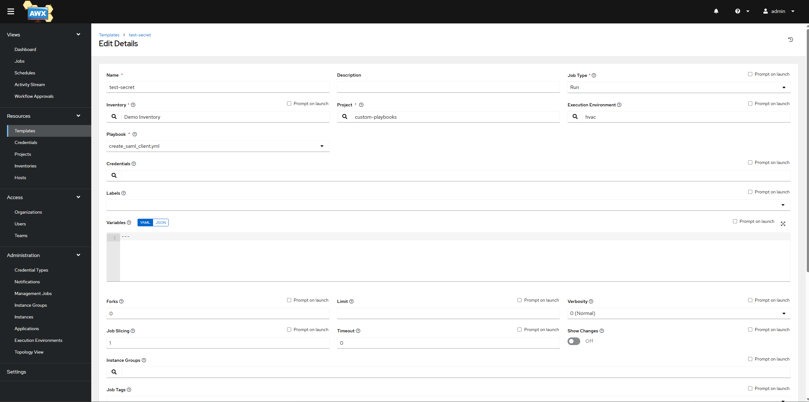

| Onderdeel             | Uitleg                                                  |
| --------------------- | ------------------------------------------------------- |
| Inventory             | Bevat de hosts waarop de job uitgevoerd wordt.          |
| Project               | Bevat de playbooks die uit Git gesynchroniseerd werden. |
| Playbook              | Het playbook dat door AWX uitgevoerd wordt.             |
| Execution Environment | Containerimage waarin Ansible en dependencies draaien.  |

De template gebruikt dus het project `custom-playbooks` en voert het playbook `create_saml_client.yml` uit.

### Custom Execution Environment gebruiken

Tijdens het testen werkte de standaard Execution Environment niet correct met het playbook. De job moest secrets uit Vault ophalen, maar de nodige dependency `hvac` was niet aanwezig.

Daarom werd een eigen Execution Environment gebouwd. De technische stappen voor het bouwen en pushen van deze image worden verderop uitgelegd in de sectie [Custom Execution Environment bouwen](#custom-ee-bouwen).

De custom Execution Environment kreeg de naam:

```text
hvac
```

en gebruikte de image:

```text
127.0.0.1:5000/awx-ee-vault:1
```

Deze image bevat de nodige dependencies om secrets uit Vault op te halen, waaronder `hvac` en de nodige Ansible collections. Hierdoor kon de AWX job het Vault-secret uitlezen tijdens het uitvoeren van het playbook.

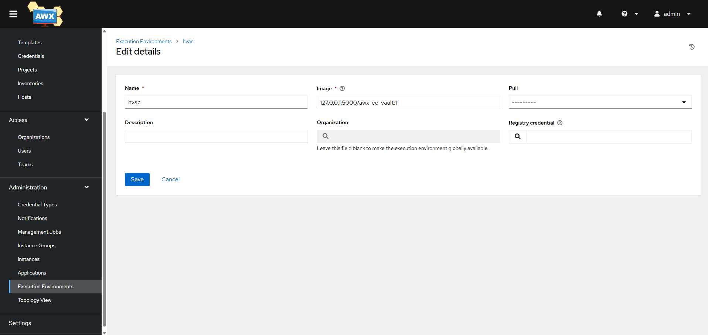

## GitHub PAT credential voor webhook

Voor de webhook-integratie werd een GitHub Personal Access Token aangemaakt.

In GitHub:

```text
Settings → Developer settings → Personal access tokens → Tokens (classic) → Generate new token
```

Bij de scopes werd `repo` geselecteerd.

Na het genereren werd de token gekopieerd. Deze token wordt maar één keer getoond en moet direct veilig bewaard worden.

Daarna werd in AWX een credential aangemaakt:

```text
Resources → Credentials → Add
```

Gebruik volgende instellingen:

| Veld            | Waarde                         |
| --------------- | ------------------------------ |
| Name            | `GitHub PAT`                   |
| Credential Type | `GitHub Personal Access Token` |
| Token           | Gegenereerde GitHub PAT        |

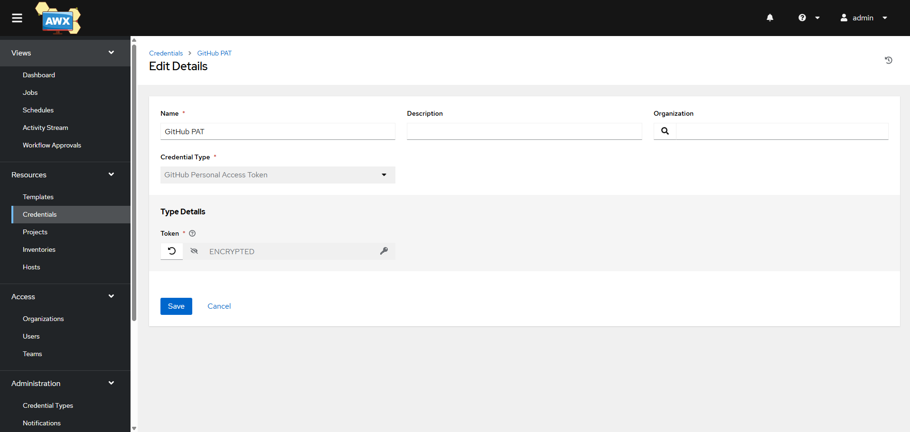

## Webhook inschakelen op de Job Template

In de Job Template werd de optie **Enable Webhook** aangezet. Hierdoor kan AWX automatisch een job starten wanneer GitHub een webhook request stuurt.

Gebruik volgende instellingen:

| Veld               | Waarde                      |
| ------------------ | --------------------------- |
| Webhook Service    | `GitHub`                    |
| Webhook Credential | `GitHub PAT`                |
| Webhook URL        | URL gegenereerd door AWX    |
| Webhook Key        | Secret gegenereerd door AWX |

De **Webhook URL** en **Webhook Key** worden later gebruikt bij het aanmaken van de webhook in GitHub.

Omdat AWX lokaal op de VM draaide, kon GitHub de interne AWX URL niet rechtstreeks bereiken. Daarom werd Tailscale Funnel gebruikt om een publieke HTTPS URL naar de lokale AWX-service te maken.

De technische stappen hiervoor worden verderop uitgelegd in de sectie [Tailscale Funnel](#tailscale-funnel).

Voorbeeld:

```text
Interne AWX URL:
https://192.168.140.141/api/v2/job_templates/9/github/

Publiek bereikbaar via Tailscale Funnel:
https://<tailscale-funnel-host>/api/v2/job_templates/9/github/
```

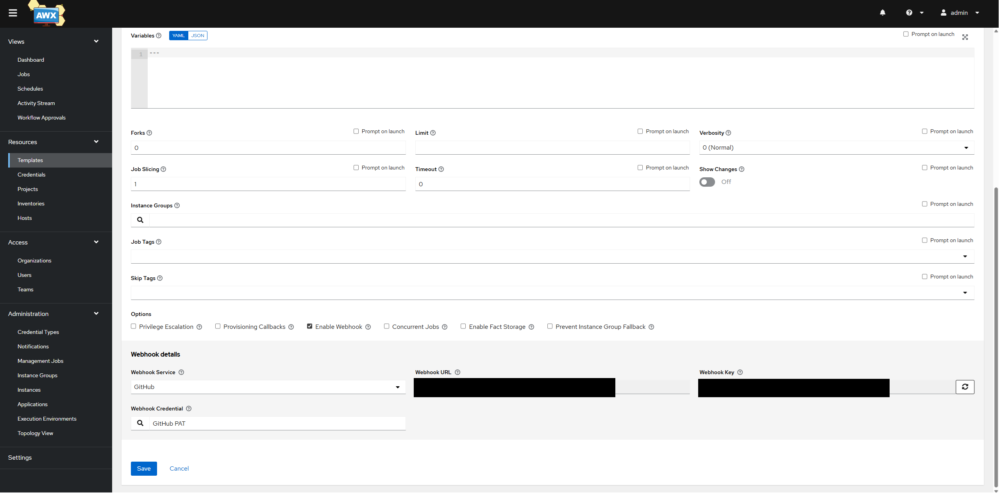

### Webhook toevoegen in GitHub

Ga in de GitHub repository naar:

```text
Settings → Webhooks → Add webhook
```

Gebruik volgende instellingen:

| Veld             | Waarde                                                               |
| ---------------- | -------------------------------------------------------------------- |
| Payload URL      | Webhook URL uit AWX, aangepast naar de publieke Tailscale Funnel URL |
| Content type     | `application/json`                                                   |
| Secret           | Webhook Key uit AWX                                                  |
| SSL verification | Enabled                                                              |
| Events           | `Just the push event`                                                |
| Active           | Aangevinkt                                                           |

Na het opslaan stuurt GitHub bij elke push een webhook request naar AWX. AWX start daarna automatisch de gekoppelde Job Template.

Hierdoor wordt bij elke nieuwe commit de meest recente playbookversie gebruikt.

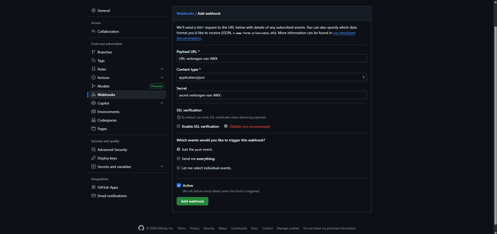

## Custom Execution Environment en Tailscale Funnel

Tijdens het uitvoeren van de AWX job ontstond een probleem met de standaard Execution Environment. De job moest secrets uit Vault ophalen, maar de nodige dependency `hvac` was niet aanwezig.

Daarom werd een eigen Execution Environment gebouwd en beschikbaar gemaakt via een lokale Docker registry.

Daarnaast draaide AWX lokaal op de VM. Omdat GitHub geen request kan sturen naar een interne lokale URL, werd Tailscale Funnel gebruikt om AWX publiek bereikbaar te maken voor webhooks.

<a id="custom-ee-bouwen"></a>

## Custom Execution Environment bouwen

### Bestanden aanmaken

Maak een map voor de Execution Environment:

```bash
mkdir -p execution_environment
cd execution_environment
```

Maak het bestand `execution-environment.yml`:

```bash
nano execution-environment.yml
```

Inhoud:

```yaml
---
version: 3

images:
  base_image:
    name: quay.io/ansible/awx-ee:24.6.1

dependencies:
  galaxy: requirements.yml
  python: requirements.txt
```

Maak `requirements.txt`:

```bash
nano requirements.txt
```

Inhoud:

```txt
hvac
```

Maak `requirements.yml`:

```bash
nano requirements.yml
```

Inhoud:

```yaml
collections:
  - name: community.hashi_vault
  - name: community.general
```

### Execution Environment builden

Verwijder eerst een oude buildcontext indien die bestaat:

```bash
rm -rf context
```

Genereer de buildcontext:

```bash
ansible-builder create -v3 --container-runtime docker -f execution-environment.yml
```

Controleer eventueel de gegenereerde Dockerfile:

```bash
head -n 5 context/Dockerfile
```

Build de image:

```bash
ansible-builder build -v3 --container-runtime docker -f execution-environment.yml -t awx-ee-vault:1
```

Controleer of de image bestaat:

```bash
docker images | grep awx-ee-vault
```

Test of de nodige dependencies aanwezig zijn:

```bash
docker run --rm awx-ee-vault:1 ansible --version
docker run --rm awx-ee-vault:1 python3 -c "import hvac; print('hvac ok')"
docker run --rm awx-ee-vault:1 python3 -c "import ansible_runner; print('runner ok')"
```

## Lokale Docker registry

AWX moet de custom image kunnen ophalen. Daarom werd een lokale Docker registry gestart op poort `5000`.

### Registry starten

```bash
docker run -d --restart=always -p 5000:5000 --name registry registry:2
```

### Image taggen

```bash
docker tag awx-ee-vault:1 127.0.0.1:5000/awx-ee-vault:1
```

### Image pushen

```bash
docker push 127.0.0.1:5000/awx-ee-vault:1
```

### Registry controleren

Controleer of de image in de registry staat:

```bash
curl -s http://127.0.0.1:5000/v2/_catalog
curl -s http://127.0.0.1:5000/v2/awx-ee-vault/tags/list
```

Verwachte output:

```json
{"repositories":["awx-ee-vault"]}
{"name":"awx-ee-vault","tags":["1"]}
```

<a id="tailscale-funnel"></a>

## Tailscale Funnel

Omdat AWX lokaal draaide, was de webhook URL standaard niet publiek bereikbaar. GitHub kan geen request sturen naar een interne lokale URL zoals:

```text
https://192.168.140.141/api/v2/job_templates/9/github/
```

Daarom werd **Tailscale Funnel** gebruikt. Hiermee werd een publieke HTTPS URL gemaakt die doorstuurt naar de lokale AWX-service op de VM.

### Tailscale installeren

Installeer Tailscale:

```bash
curl -fsSL https://tailscale.com/install.sh | sh
```

Verbind de machine met Tailscale:

```bash
sudo tailscale up
```

Indien een auth key gebruikt wordt:

```bash
sudo tailscale up --auth-key=<REDACTED>
```

Controleer de status:

```bash
tailscale status
tailscale version
```

### Oude serve/funnel configuratie resetten

Indien er al een oude Tailscale Serve of Funnel configuratie bestaat, kan deze eerst gereset worden:

```bash
sudo tailscale serve reset
sudo tailscale funnel reset
```

### AWX via Tailscale beschikbaar maken

AWX draaide lokaal via HTTPS op poort `443`. Omdat er een self-signed certificaat gebruikt werd, werd `https+insecure` gebruikt.

```bash
sudo tailscale serve --bg https+insecure://127.0.0.1:443
sudo tailscale funnel --bg 443
```

Controleer daarna de configuratie:

```bash
tailscale serve status
tailscale funnel status
```

Test de publieke Tailscale URL:

```bash
curl -vk https://<tailscale-hostname>/
```

Wanneer deze test response teruggeeft van AWX, is de lokale AWX-service publiek bereikbaar via Tailscale Funnel.

### Webhook URL aanpassen

In AWX geeft de Job Template een webhook URL. Die URL moet publiek bereikbaar zijn voor GitHub.

De interne URL wordt daarom vervangen door de publieke Tailscale Funnel URL.

Voorbeeld:

```text
Interne AWX webhook URL:
https://192.168.140.141/api/v2/job_templates/9/github/

Publieke webhook URL via Tailscale Funnel:
https://<tailscale-hostname>/api/v2/job_templates/9/github/
```

In GitHub werd deze publieke URL gebruikt bij:

```text
Repository → Settings → Webhooks → Add webhook
```

Gebruik volgende instellingen:

| Veld         | Waarde                               |
| ------------ | ------------------------------------ |
| Payload URL  | AWX webhook URL via Tailscale Funnel |
| Content type | `application/json`                   |
| Secret       | Webhook Key uit AWX                  |
| Events       | `Just the push event`                |
| Active       | Aangevinkt                           |

Na het opslaan stuurt GitHub bij elke push een webhook request naar AWX. AWX voert daarna automatisch de gekoppelde Job Template uit.

## Vault token meegeven aan AWX job

Om secrets uit Vault te kunnen ophalen tijdens het uitvoeren van een AWX job, werd de Vault token als AWX credential meegegeven aan de job. Hierdoor kan het playbook de token gebruiken via een environment variable.

### Credential koppelen aan Job Template

Ga naar de Job Template:

```text
Resources → Templates → test-secret → Edit
```

Bij **Credentials** werd de credential toegevoegd.

Tijdens het selecteren werd de categorie aangepast naar:

```text
Vault Token Environment
```

Daarna werd de credential geselecteerd:

```text
Vault Token
```

In de template kan deze zichtbaar zijn als:

```text
Cloud: Vault Token
```

Dit is normaal. AWX toont custom/injected credentials soms onder deze categorie, maar de environment variable wordt correct geïnjecteerd.

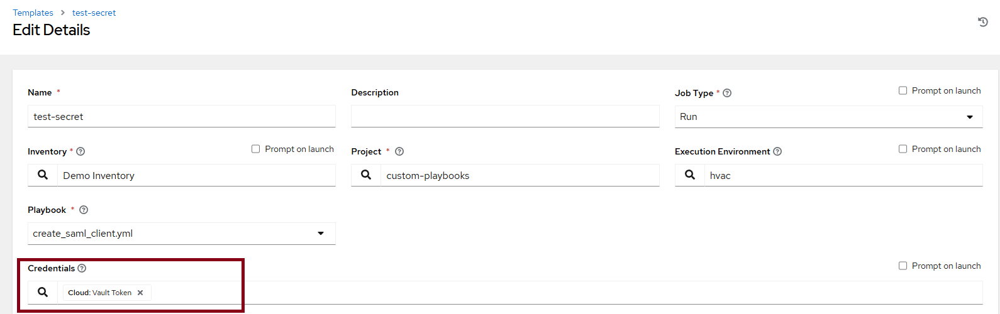

## Playbook `create_saml_client.yml`

Het playbook `create_saml_client.yml` is het hoofdplaybook dat door AWX uitgevoerd wordt. Het doel van dit playbook is om automatisch Access Management-configuratie uit te voeren. In deze proof-of-concept wordt Keycloak gebruikt als Access Management-systeem.

Het playbook wordt uitgevoerd vanuit AWX en gebruikt de configuratiebestanden in de Ansible roles om te bepalen welke Vault secrets, Keycloak-instellingen, realm, bootstrap user en SAML metadata gebruikt moeten worden.

## Wat moet de gebruiker invullen?

Voor een nieuwe omgeving of applicatie moeten vooral vier onderdelen aangepast worden.

| Bestand                                    | Wat wordt hier ingesteld?                                                 |
| ------------------------------------------ | ------------------------------------------------------------------------- |
| `roles/am_common/defaults/main.yml`        | Vault-server, Vault paths en secret key-namen.                            |
| `roles/am_keycloak/files/IAM_Showcase.xml` | SAML metadata van de applicatie, zoals client ID en ACS URL.              |
| `roles/am_keycloak/defaults/main.yml`      | Keycloak URL, target realm en bootstrap user.                             |
| `roles/am_provision/defaults/main.yml`     | Welke Access Management-provider gebruikt wordt, bijvoorbeeld `keycloak`. |

De gevoelige waarden zelf, zoals wachtwoorden of tokens, worden niet in Git opgeslagen. In Git staan enkel configuratiewaarden zoals Vault-paden, key-namen, realm-namen en XML metadata. De effectieve secrets worden beheerd in Vault en opgehaald tijdens de uitvoering van de AWX job.

## 1. Vault-configuratie

Bestand:

```text
roles/am_common/defaults/main.yml
```

Voorbeeld:

```yaml
---
vault_addr: "https://192.168.140.141:8200"
vault_token: "{{ lookup('env', 'VAULT_TOKEN') }}"
vault_validate_certs: false

keycloak_admin_password_vault_path: "secret/data/test/keycloak"
keycloak_admin_password_key: "password"

keycloak_bootstrap_password_vault_path: "secret/data/test/keycloak-bootstrap-user"
keycloak_bootstrap_password_key: "bootstrap_password"
```

Hier wordt ingesteld waar Vault bereikbaar is en op welke Vault-paden de nodige secrets staan.

| Variabele                                | Betekenis                                                               |
| ---------------------------------------- | ----------------------------------------------------------------------- |
| `vault_addr`                             | URL van de Vault-server.                                                |
| `vault_token`                            | Wordt opgehaald uit de environment variable `VAULT_TOKEN`.              |
| `vault_validate_certs`                   | Bepaalt of TLS-certificaten gevalideerd worden.                         |
| `keycloak_admin_password_vault_path`     | Vault-pad waar het Keycloak admin wachtwoord staat of aangemaakt wordt. |
| `keycloak_admin_password_key`            | Key-naam binnen het Vault secret voor het admin wachtwoord.             |
| `keycloak_bootstrap_password_vault_path` | Vault-pad waar het bootstrap user wachtwoord staat of aangemaakt wordt. |
| `keycloak_bootstrap_password_key`        | Key-naam binnen het Vault secret voor het bootstrap wachtwoord.         |

De gebruiker geeft hier dus per secret twee zaken mee:

1. het Vault-pad waar het secret moet staan;
2. de key-naam waaronder de waarde opgeslagen wordt.

De Vault token zelf staat niet in Git. Die wordt via AWX als credential meegegeven aan de job. Hierdoor kan het playbook secrets ophalen zonder dat de token hardcoded in de repository staat.

In AWX kan hiervoor een HashiCorp Vault credential of secret lookup gebruikt worden. De token wordt daar encrypted opgeslagen en is niet zichtbaar in de repository of job output.

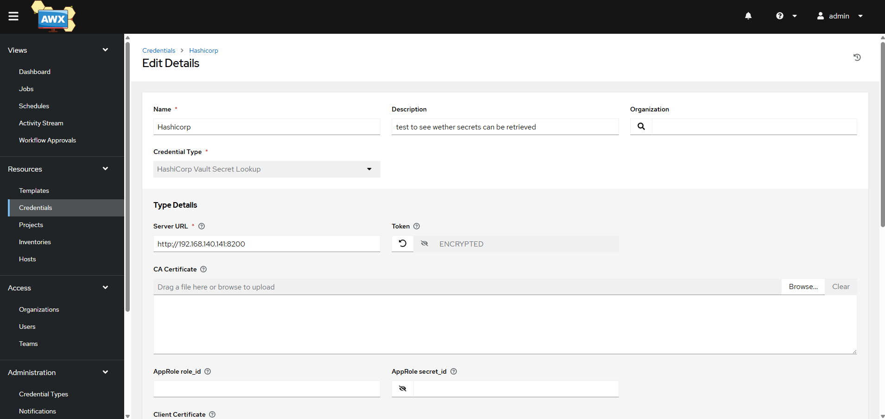

### Automatische secret-controle en aanmaak

Het playbook gebruikt de Vault-paden en key-namen uit `roles/am_common/defaults/main.yml` om te controleren of de nodige secrets al bestaan in Vault.

De flow is:

```text
Vault-pad en key-naam uitlezen uit configuratie
→ controleren of het secret bestaat in Vault
→ als het secret bestaat: bestaande waarde ophalen en gebruiken
→ als het secret niet bestaat: random wachtwoord genereren
→ random wachtwoord opslaan op het opgegeven Vault-pad
→ wachtwoord gebruiken tijdens de Keycloak-configuratie
```

Hierdoor moet de gebruiker geen wachtwoorden in Git plaatsen. De gebruiker geeft enkel aan **waar** het secret moet staan en **onder welke key-naam** de waarde opgeslagen wordt.

Voorbeeld:

```yaml
keycloak_bootstrap_password_vault_path: "secret/data/test/keycloak-bootstrap-user"
keycloak_bootstrap_password_key: "bootstrap_password"
```

Dit betekent dat het playbook controleert of op het Vault-pad `secret/data/test/keycloak-bootstrap-user` een key bestaat met de naam `bootstrap_password`.

Als deze key bestaat, wordt de bestaande waarde gebruikt. Als deze key niet bestaat, genereert het playbook een random wachtwoord en schrijft dit weg naar Vault onder die key-naam.

Wanneer het playbook automatisch een secret heeft aangemaakt, kan de gebruiker deze waarde achteraf raadplegen via Vault of via de HashiCorp Vault Secret Lookup-integratie in AWX.

De verdeling blijft hierdoor duidelijk:

| Onderdeel | Doel                                                         |
| --------- | ------------------------------------------------------------ |
| Git       | Bevat enkel configuratie zoals Vault-paden en key-namen.     |
| Vault     | Bevat de echte geheime waarden zoals wachtwoorden.           |
| AWX       | Voert het playbook uit en haalt secrets veilig op uit Vault. |

## 2. SAML metadata XML

Bestand:

```text
roles/am_keycloak/files/IAM_Showcase.xml
```

Voorbeeld:

```xml
<md:EntityDescriptor
    xmlns:md="urn:oasis:names:tc:SAML:2.0:metadata"
    xmlns:ds="http://www.w3.org/2000/09/xmldsig#"
    entityID="IAMShowcase"
    validUntil="2035-12-09T09:13:31.006Z">
    <md:SPSSODescriptor AuthnRequestsSigned="false" WantAssertionsSigned="true" protocolSupportEnumeration="urn:oasis:names:tc:SAML:2.0:protocol">
        <md:NameIDFormat>urn:oasis:names:tc:SAML:1.1:nameid-format:unspecified</md:NameIDFormat>
        <md:NameIDFormat>urn:oasis:names:tc:SAML:1.1:nameid-format:emailAddress</md:NameIDFormat>
        <md:AssertionConsumerService Binding="urn:oasis:names:tc:SAML:2.0:bindings:HTTP-POST" Location="https://sptest.iamshowcase.com/acs-updated" index="0" isDefault="true" />
    </md:SPSSODescriptor>
</md:EntityDescriptor>
```

Het playbook haalt hier automatisch de belangrijkste SAML-waarden uit.

| XML-waarde                          | Wordt gebruikt als          |
| ----------------------------------- | --------------------------- |
| `entityID`                          | SAML client ID in Keycloak. |
| `AssertionConsumerService Location` | ACS URL / redirect URI.     |

In dit voorbeeld wordt dus een SAML client aangemaakt met:

```text
Client ID: IAMShowcase
ACS URL: https://sptest.iamshowcase.com/acs-updated
```

Wanneer een andere applicatie gekoppeld moet worden, moet vooral dit XML-bestand vervangen of aangepast worden.

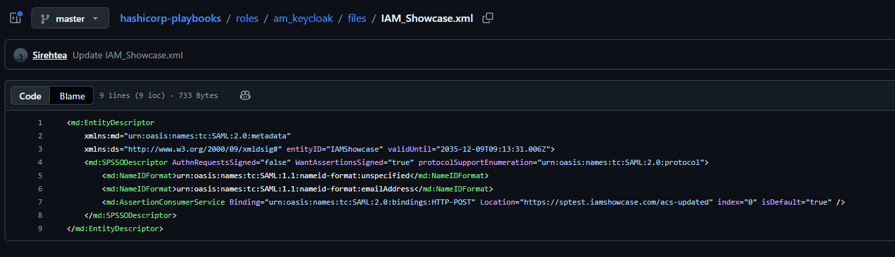

## 3. Keycloak-configuratie

Bestand:

```text
roles/am_keycloak/defaults/main.yml
```

Voorbeeld:

```yaml
---
xml_file: "{{ role_path }}/files/IAM_Showcase.xml"
target_realm: "mytestrealm45"

keycloak_base_url: "http://192.168.140.141:8080"
keycloak_admin_realm: "master"
keycloak_admin_user: "admin"
keycloak_validate_certs: false

bootstrap_username: "bootstrap-user"
bootstrap_first_name: "Bootstrap"
bootstrap_last_name: "User"
bootstrap_email: "bootstrap-user@local.test"
```

Hier worden de Keycloak-specifieke waarden ingesteld.

| Variabele                 | Betekenis                                       |
| ------------------------- | ----------------------------------------------- |
| `xml_file`                | Pad naar de SAML metadata XML.                  |
| `target_realm`            | Realm die gecontroleerd of aangemaakt wordt.    |
| `keycloak_base_url`       | URL van de Keycloak-server.                     |
| `keycloak_admin_realm`    | Realm waartegen de admin authenticatie gebeurt. |
| `keycloak_admin_user`     | Keycloak admin gebruiker.                       |
| `keycloak_validate_certs` | Certificaatvalidatie voor Keycloak.             |
| `bootstrap_username`      | Gebruikersnaam van de bootstrap user.           |
| `bootstrap_first_name`    | Voornaam van de bootstrap user.                 |
| `bootstrap_last_name`     | Achternaam van de bootstrap user.               |
| `bootstrap_email`         | E-mailadres van de bootstrap user.              |

De gebruiker kan hier dus onder andere de target realm, Keycloak URL en bootstrap user aanpassen.

## 4. Providerselectie

Bestand:

```text
roles/am_provision/defaults/main.yml
```

Voorbeeld:

```yaml
---
am_system: "keycloak"
```

Deze waarde bepaalt welke Access Management-provider gebruikt wordt.

| Waarde     | Betekenis                                                     |
| ---------- | ------------------------------------------------------------- |
| `keycloak` | Voert de Keycloak-role uit.                                   |
| `ibm`      | Voorziene placeholder voor een toekomstige IBM AM-integratie. |

Momenteel is `keycloak` de werkende provider. De IBM-role bestaat als uitbreidingspunt, maar is nog niet functioneel uitgewerkt.

## Uitvoeringsflow

Het einddoel van het playbook is:

```text
AWX Job Template
→ create_saml_client.yml
→ secrets controleren/ophalen of aanmaken in Vault
→ authenticeren tegen Keycloak
→ realm controleren/aanmaken
→ bootstrap user controleren/aanmaken
→ SAML client importeren uit XML metadata
→ SAML client instellingen bijwerken
```

## Hoofdplaybook

Het bestand `create_saml_client.yml` bevat zelf weinig logica. Het roept de role `am_provision` aan.

```yaml
---
- name: Ensure AM resources exist
  hosts: localhost
  connection: local
  gather_facts: false

  roles:
    - role: am_provision
```

Omdat `hosts: localhost` en `connection: local` gebruikt worden, draait het playbook lokaal binnen de AWX Execution Environment. De acties gebeuren daarna via API-calls naar Vault en Keycloak.

## Role-structuur

De playbooks zijn opgesplitst in verschillende roles.

```text
roles/
├── am_common/
├── am_keycloak/
├── am_ibm/
└── am_provision/
```

| Role           | Doel                                                                                                                       |
| -------------- | -------------------------------------------------------------------------------------------------------------------------- |
| `am_common`    | Algemene taken die voor meerdere AM-systemen gebruikt kunnen worden, zoals Vault secrets controleren, ophalen of aanmaken. |
| `am_keycloak`  | Keycloak-specifieke taken zoals authenticatie, realm, bootstrap user en SAML client.                                       |
| `am_ibm`       | Placeholder voor toekomstige IBM AM-integratie.                                                                            |
| `am_provision` | Bepaalt welk AM-systeem gebruikt wordt en roept de juiste provider-role aan.                                               |

## Providerselectie via `am_provision`

De role `am_provision` bepaalt welke Access Management-provider uitgevoerd wordt.

In `roles/am_provision/tasks/main.yml` wordt eerst de algemene voorbereiding uitgevoerd:

```yaml
- name: Run common AM preparation tasks
  ansible.builtin.include_role:
    name: am_common
```

Daarna wordt op basis van `am_system` de juiste provider-role uitgevoerd:

```yaml
- name: Run Keycloak provider role
  ansible.builtin.include_role:
    name: am_keycloak
  when: am_system == "keycloak"

- name: Run IBM provider role
  ansible.builtin.include_role:
    name: am_ibm
  when: am_system == "ibm"
```

Hierdoor kan de oplossing later uitgebreid worden naar een ander AM-systeem zonder het hoofdplaybook volledig te moeten herschrijven. Er moet dan vooral een nieuwe provider-role geïmplementeerd worden met provider-specifieke API-calls.

## Vault secrets controleren, ophalen of aanmaken

De role `am_common` voert `tasks/vault.yml` uit. Daarin worden de nodige secrets in Vault gecontroleerd.

De belangrijkste secrets zijn:

```text
Keycloak admin password
Bootstrap user password
```

De taak gebruikt de Vault-paden en key-namen uit:

```text
roles/am_common/defaults/main.yml
```

Daarna gebeurt volgende logica:

```text
Bestaat het secret?
→ ja: waarde ophalen en gebruiken
→ nee: random wachtwoord genereren, opslaan in Vault en daarna gebruiken
```

Deze waarden worden opgeslagen als Ansible facts:

```yaml
keycloak_admin_password
bootstrap_user_password
```

Deze facts worden later gebruikt door de Keycloak-taken.

## Keycloak taken

De role `am_keycloak` voert meerdere taken uit:

```text
auth.yml
realm.yml
bootstrap_user.yml
saml_client.yml
```

### `auth.yml`

Deze taak haalt een admin access token op via de Keycloak token endpoint.

De admin gebruiker komt uit:

```yaml
keycloak_admin_user
```

Het wachtwoord komt uit Vault via:

```yaml
keycloak_admin_password
```

Het access token wordt daarna gebruikt voor de Keycloak Admin API.

### `realm.yml`

Deze taak controleert of de opgegeven realm bestaat.

Als de realm niet bestaat, wordt deze aangemaakt.

Voorbeeld:

```yaml
target_realm: "mytestrealm45"
```

### `bootstrap_user.yml`

Deze taak controleert of de bootstrap user bestaat.

Als de user nog niet bestaat, wordt deze aangemaakt met:

```yaml
bootstrap_username
bootstrap_first_name
bootstrap_last_name
bootstrap_email
```

Daarna wordt het bootstrap wachtwoord ingesteld met het wachtwoord dat uit Vault werd opgehaald of automatisch werd aangemaakt.

### `saml_client.yml`

Deze taak leest de SAML metadata XML uit, haalt hieruit de `entityID` en ACS URL, controleert of de client al bestaat en importeert de SAML client indien nodig.

Daarna worden enkele SAML-instellingen bijgewerkt, zoals:

```text
redirectUris
saml.client.signature
saml.assertion.signature
saml_assertion_consumer_url_post
```

## Uitbreiding naar andere AM-systemen

De structuur is voorzien om later andere Access Management-systemen te ondersteunen.

Momenteel is dit ingesteld:

```yaml
am_system: "keycloak"
```

Voor een andere provider zou dit bijvoorbeeld kunnen worden:

```yaml
am_system: "ibm"
```

De algemene flow blijft hetzelfde:

```text
create_saml_client.yml
→ am_provision
→ am_common
→ provider-role
```

Alle provider-specifieke logica zit dan in een aparte role.

## Resultaat

Na een succesvolle AWX job is het resultaat:

```text
Vault secrets gecontroleerd
Ontbrekende Vault secrets automatisch aangemaakt
Keycloak admin token verkregen
Realm gecontroleerd/aangemaakt
Bootstrap user gecontroleerd/aangemaakt
SAML metadata gelezen
SAML client gecontroleerd/aangemaakt
SAML client instellingen bijgewerkt
```

Hierdoor wordt de SAML client niet meer manueel via de Keycloak GUI aangemaakt, maar automatisch via Ansible en AWX.
